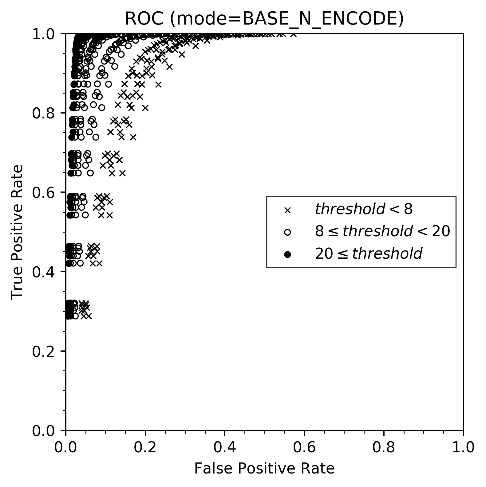
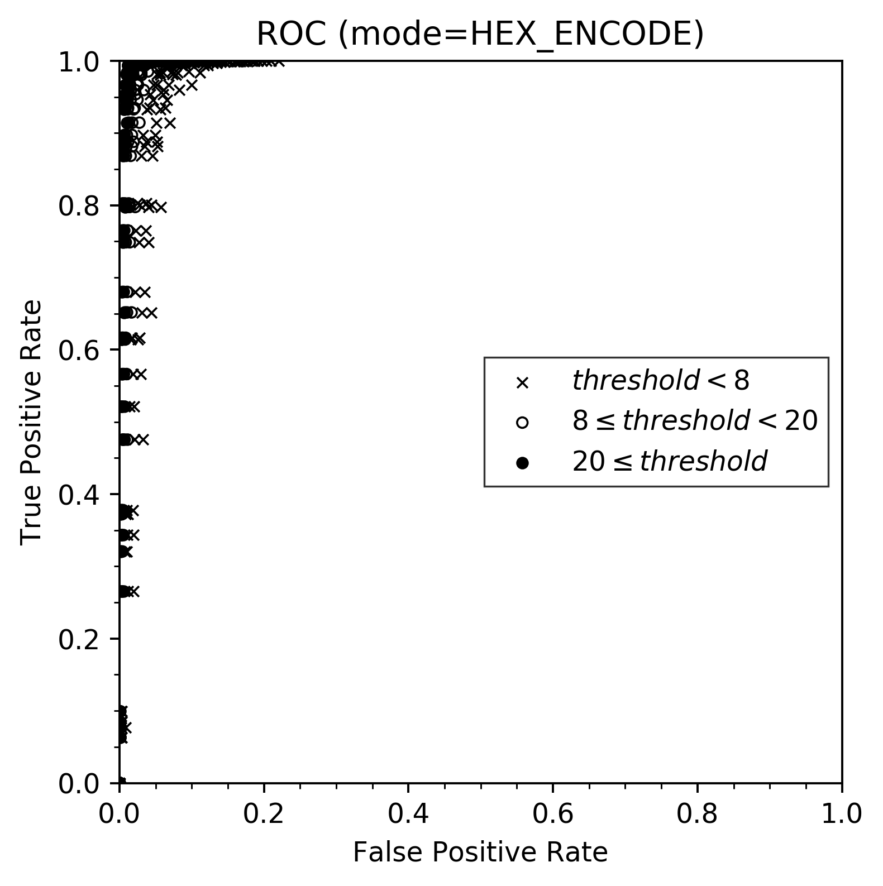

Detect DNS Tunneling Project
=====

How I detect DNS Tunneling
-----
see `detect_dns_tunneling.c`

Mainly I used following techniques:

* unigram and its frequency 
* Normal Distribution

How to use
----
1. run `./build-and-test.sh` to evaluate detection accuracy
2. run `python plot_roc_chart.py` to generate ROC chart

Host Names to Test
----
See `build-and-test.sh` for detail.

### `clean-fqdn.txt`
Collected FQDNs from VirusTotal. Domains are in [opendns/public-domain-lists](https://github.com/opendns/public-domain-lists/).

### Base-n Encode & Hex Encode
To hide leaked information, these encode are uesed.
DNS tunnneling FDQNs are genereted based on PDF and Text Files.

Results
----
Not so bad. See C source code for more information.

Related Material
----
* [C92 - TomoriNao Vol.1 (Dojinshi)](http://tomorinao.pro/), the Chapter I (@K\_atc) wrote
    * Written in Japanese and not free access. Sorry!
